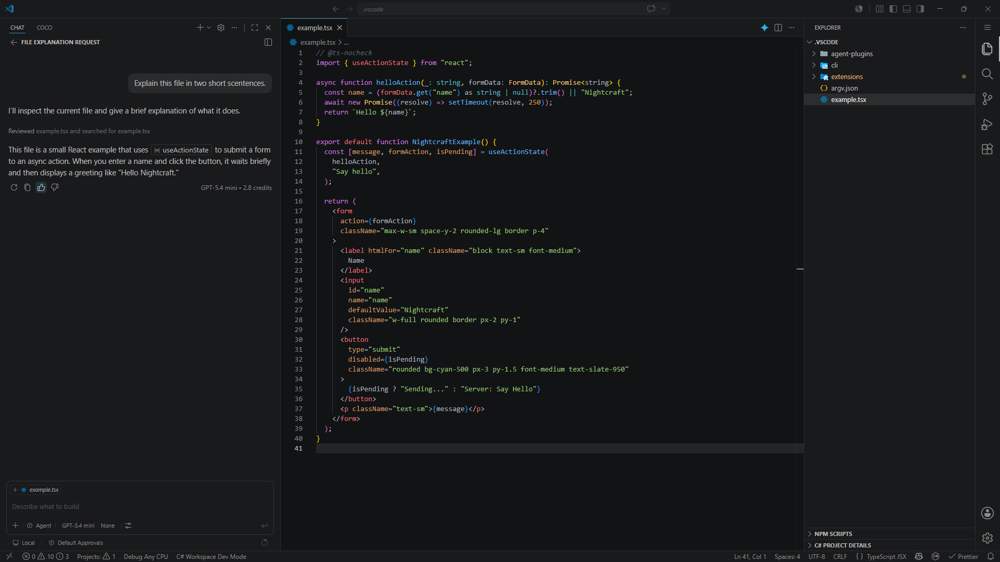

# Nightcraft

VS Code dark theme. Blends [Atom One Dark](https://marketplace.visualstudio.com/items?itemName=akamud.vscode-theme-onedark) syntax tokens with [VS Code Dark Modern](https://github.com/microsoft/vscode/blob/main/extensions/theme-defaults/themes/dark_modern.json) UI chrome - both pushed darker.

## Palette

|        | Hex       |
| ------ | --------- |
| Editor | `#121314` |
| Chrome | `#191A1B` |
| Accent | `#3994BC` |
| Text   | `#bfbfbf` |

## Install

Extensions (`Ctrl+Shift+X`) → search **Nightcraft** → Install

Or: `code --install-extension matt-wigg.vscode-theme-nightcraft`

## License

[MIT](LICENSE) · [Matt Wigg](https://github.com/matt-wigg)
